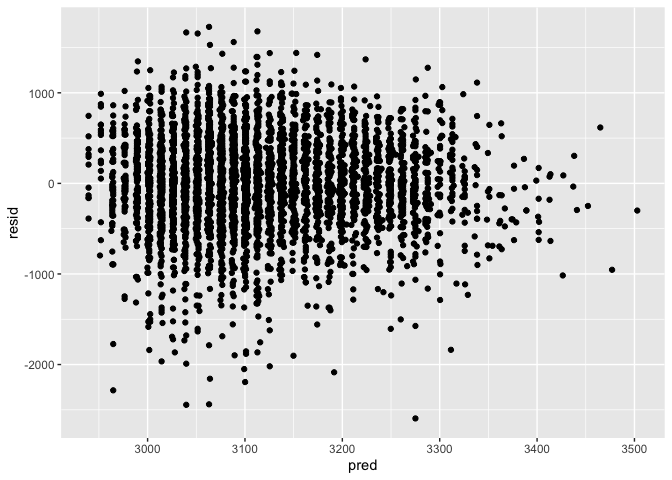
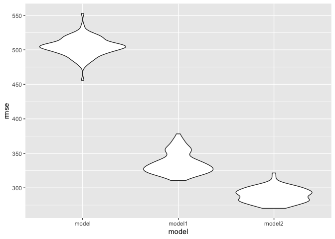
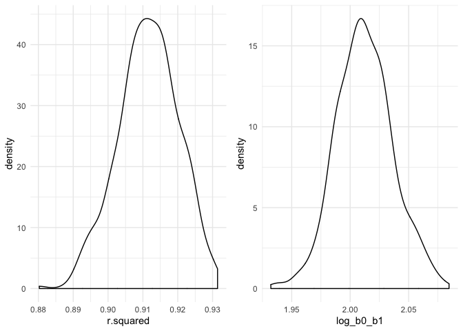

p8105\_hw6\_TS3175
================
Tanu
11/20/2019

# Problem 1

Loading in dataset, creating factor variables, and checking for missing
data

``` r
bwt_data = read.csv("birthweight.csv") %>% 
  janitor::clean_names() %>% 
  mutate(
    babysex = factor(babysex,    levels= c("1", "2"),
                                 labels = c("male", "female")),
    frace =   factor(frace,      levels= c("1", "2", "3", "4", "8", "9"),
                                 labels = c("white", "black","asian", "puerto rican", "other", "uknown")),
    malform = factor(malform,    levels= c("0", "1"),
                                 labels = c("absent", "present")),
    mrace = factor(mrace,        levels= c("1", "2", "3", "4", "8", "9"),
                                 labels = c("white", "black","asian", "puerto rican", "other", "uknown"))
  )

  skimr::skim(bwt_data)
```

    ## Skim summary statistics
    ##  n obs: 4342 
    ##  n variables: 20 
    ## 
    ## ── Variable type:factor ───────────────────────────
    ##  variable missing complete    n n_unique
    ##   babysex       0     4342 4342        2
    ##     frace       0     4342 4342        5
    ##   malform       0     4342 4342        2
    ##     mrace       0     4342 4342        4
    ##                               top_counts ordered
    ##              mal: 2230, fem: 2112, NA: 0   FALSE
    ##  whi: 2123, bla: 1911, pue: 248, asi: 46   FALSE
    ##                abs: 4327, pre: 15, NA: 0   FALSE
    ##  whi: 2147, bla: 1909, pue: 243, asi: 43   FALSE
    ## 
    ## ── Variable type:integer ──────────────────────────
    ##  variable missing complete    n      mean     sd  p0  p25    p50  p75 p100
    ##     bhead       0     4342 4342   33.65     1.62  21   33   34     35   41
    ##   blength       0     4342 4342   49.75     2.72  20   48   50     51   63
    ##       bwt       0     4342 4342 3114.4    512.15 595 2807 3132.5 3459 4791
    ##     delwt       0     4342 4342  145.57    22.21  86  131  143    157  334
    ##   fincome       0     4342 4342   44.11    25.98   0   25   35     65   96
    ##  menarche       0     4342 4342   12.51     1.48   0   12   12     13   19
    ##   mheight       0     4342 4342   63.49     2.66  48   62   63     65   77
    ##    momage       0     4342 4342   20.3      3.88  12   18   20     22   44
    ##    parity       0     4342 4342    0.0023   0.1    0    0    0      0    6
    ##   pnumlbw       0     4342 4342    0        0      0    0    0      0    0
    ##   pnumsga       0     4342 4342    0        0      0    0    0      0    0
    ##      ppwt       0     4342 4342  123.49    20.16  70  110  120    134  287
    ##    wtgain       0     4342 4342   22.08    10.94 -46   15   22     28   89
    ##      hist
    ##  ▁▁▁▁▅▇▁▁
    ##  ▁▁▁▁▁▇▁▁
    ##  ▁▁▁▃▇▇▂▁
    ##  ▁▇▅▁▁▁▁▁
    ##  ▁▂▇▂▂▂▁▃
    ##  ▁▁▁▁▂▇▁▁
    ##  ▁▁▁▅▇▂▁▁
    ##  ▂▇▅▂▁▁▁▁
    ##  ▇▁▁▁▁▁▁▁
    ##  ▁▁▁▇▁▁▁▁
    ##  ▁▁▁▇▁▁▁▁
    ##  ▁▇▆▁▁▁▁▁
    ##  ▁▁▁▇▇▁▁▁
    ## 
    ## ── Variable type:numeric ──────────────────────────
    ##  variable missing complete    n  mean   sd    p0   p25   p50   p75 p100
    ##   gaweeks       0     4342 4342 39.43 3.15 17.7  38.3  39.9  41.1  51.3
    ##     ppbmi       0     4342 4342 21.57 3.18 13.07 19.53 21.03 22.91 46.1
    ##    smoken       0     4342 4342  4.15 7.41  0     0     0     5    60  
    ##      hist
    ##  ▁▁▁▁▃▇▁▁
    ##  ▁▇▅▁▁▁▁▁
    ##  ▇▁▁▁▁▁▁▁

Created a model for birthweight based on mother’s age and family income
because these are factors noted in the literature as associated with
stress and ultimately baby health. Then plotted residuals against fitted
values.

``` r
model = lm(bwt ~ momage + fincome, data = bwt_data) 
model %>% 
  broom::tidy() %>% 
  select(term, estimate, p.value) %>% 
  knitr::kable(digits = 3)
```

| term        | estimate | p.value |
| :---------- | -------: | ------: |
| (Intercept) | 2749.991 |       0 |
| momage      |   12.657 |       0 |
| fincome     |    2.437 |       0 |

``` r
  modelr::add_residuals(bwt_data,model) %>% 
  modelr::add_predictions(model) %>% 
  ggplot(aes(x = pred, y = resid)) +
  geom_point()
```

<!-- -->

Made comparisons of the following models in terms of the cross-validated
prediction error using crossv\_mc and functions in purrr.

``` r
model1= lm(bwt ~ blength + gaweeks, data=bwt_data) 
model1 %>% 
  broom::tidy() %>% 
  select(term, estimate, p.value) %>% 
  knitr::kable(digits = 3)
```

| term        |   estimate | p.value |
| :---------- | ---------: | ------: |
| (Intercept) | \-4347.667 |       0 |
| blength     |    128.556 |       0 |
| gaweeks     |     27.047 |       0 |

``` r
model2= lm(bwt ~ bhead + blength + babysex + bhead*blength + bhead*babysex + blength*babysex + babysex*blength*bhead, data=bwt_data)

model2 %>% 
  broom::tidy() %>% 
  select(term, estimate, p.value) %>% 
  knitr::kable(digits = 3)
```

| term                        |   estimate | p.value |
| :-------------------------- | ---------: | ------: |
| (Intercept)                 | \-7176.817 |   0.000 |
| bhead                       |    181.796 |   0.000 |
| blength                     |    102.127 |   0.000 |
| babysexfemale               |   6374.868 |   0.000 |
| bhead:blength               |    \-0.554 |   0.478 |
| bhead:babysexfemale         |  \-198.393 |   0.000 |
| blength:babysexfemale       |  \-123.773 |   0.000 |
| bhead:blength:babysexfemale |      3.878 |   0.000 |

``` r
cv_df =
  crossv_mc(bwt_data, 100) %>% 
  mutate(
    train = map(train, as_tibble),
    test = map(test, as_tibble))
```

``` r
cv_df=
 cv_df %>% 
  mutate(model  = map(train, ~lm(bwt ~ momage + fincome, data = .x)),
   model1 = map(train, ~lm(bwt ~ blength + gaweeks, data = .x)),
   model2 = map(train, ~lm(bwt ~ bhead + blength + babysex + bhead*blength + bhead*babysex + blength*babysex + bhead*blength*babysex, data = as_tibble(.x)))) %>% 
  mutate(rmse_model = map2_dbl(model, test, ~rmse(model = .x, data = .y)),
  rmse_model1 = map2_dbl(model1, test, ~rmse(model = .x, data = .y)),
  rmse_model2 = map2_dbl(model2, test, ~rmse(model = .x, data = .y)))
```

``` r
cv_df %>% 
  select(starts_with("rmse")) %>% 
pivot_longer(
    everything(),
    names_to = "model", 
    values_to = "rmse",
    names_prefix = "rmse_") %>% 
  mutate(model = fct_inorder(model)) %>% 
  ggplot(aes(x = model, y = rmse)) + geom_violin()
```

<!-- -->

Model 2 appears to be the best model.

# Problem 2

``` r
weather_df = 
  rnoaa::meteo_pull_monitors(
    c("USW00094728"),
    var = c("PRCP", "TMIN", "TMAX"), 
    date_min = "2017-01-01",
    date_max = "2017-12-31") %>%
  mutate(
    name = recode(id, USW00094728 = "CentralPark_NY"),
    tmin = tmin / 10,
    tmax = tmax / 10) %>%
  select(name, id, everything())
```

Used 5000 bootstrap samples and, for each bootstrap sample, produced
estimates of these two quantities. Then, I plotted the distribution of
my estimates.

``` r
samples = weather_df %>% modelr::bootstrap(n = 500) %>% 
  mutate(
    models = map(strap, ~ lm(tmax ~ tmin, data = .x)),
    results = map(models, broom::tidy),
    glance = map(models, broom::glance)) %>% 
  select(results, glance, .id) %>% 
  unnest(results) %>% 
  pivot_wider( 
    names_from = term,
    values_from = c(estimate, std.error, glance),
    id_cols = .id, 
    ) %>%
  janitor::clean_names() %>%
  unnest(c(glance_intercept), .names_repair = "universal") %>% 
  mutate(
    log_b0_b1 = log(estimate_intercept * estimate_tmin)
  )  
```

    ## Warning: unnest() has a new interface. See ?unnest for details.
    ## Try `df %>% unnest(c(`c(glance_intercept)`, .names_repair))`, with `mutate()` if needed

``` r
rsq = samples %>% 
  ggplot(aes(x = r.squared)) + 
  geom_density() + 
  theme_minimal() 
betas = samples %>% 
  ggplot(aes(x = log_b0_b1)) + 
  geom_density() + 
  theme_minimal() 

rsq + betas
```

<!-- -->

The plots above appear to be normally distributed and unimodal. The r
squared distribution has a median of approximately 0.915 while the
log\_b0\_b1 has a median of approximately 2.015.

Then, I used the 5000 bootstrap estimates, identify the 2.5% and 97.5%
quantiles to provide a 95% confidence interval for r̂ 2 and log(β̂ 0∗β̂
1).

``` r
samples %>% 
  pull(r.squared) %>% 
  quantile(c(0.025, 0.975)) %>% 
  knitr::kable(col.names = "R-Squared")
```

|       | R-Squared |
| ----- | --------: |
| 2.5%  | 0.8938185 |
| 97.5% | 0.9273430 |

``` r
samples %>% 
  pull(log_b0_b1) %>% 
  quantile(c(0.025, 0.975)) %>% 
  knitr::kable(col.names = "Log(B0*B1)")
```

|       | Log(B0\*B1) |
| ----- | ----------: |
| 2.5%  |    1.965261 |
| 97.5% |    2.061436 |
